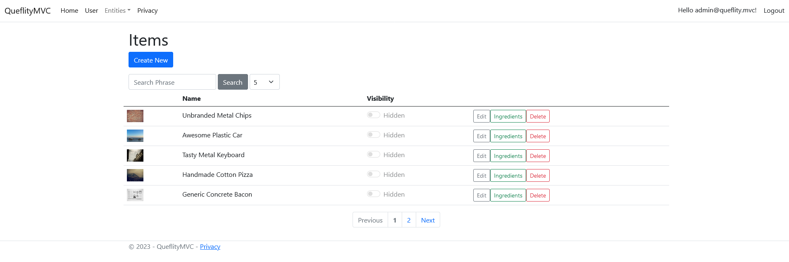
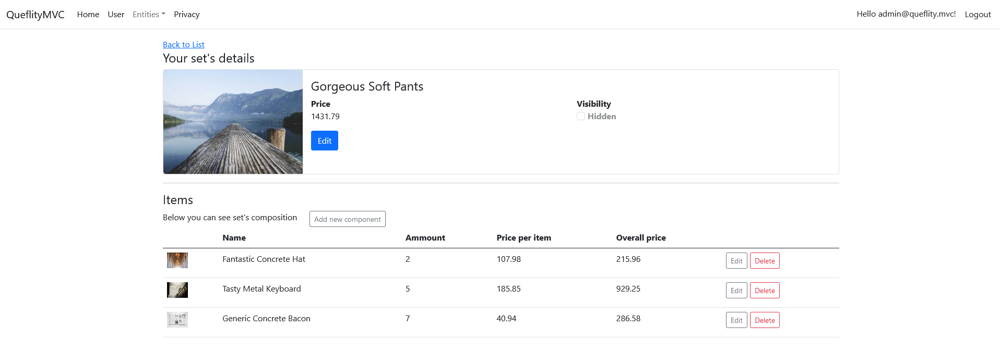
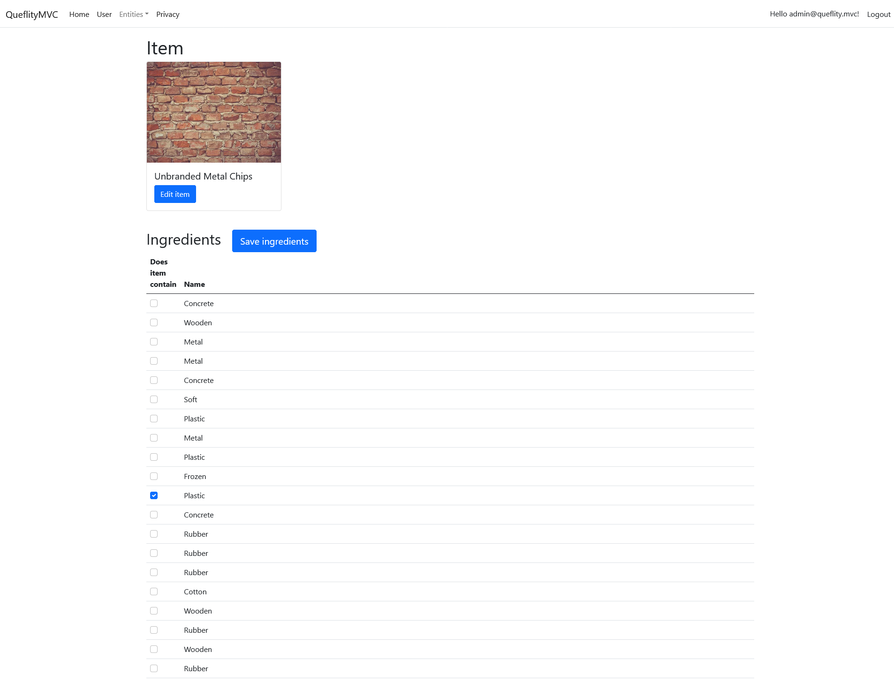
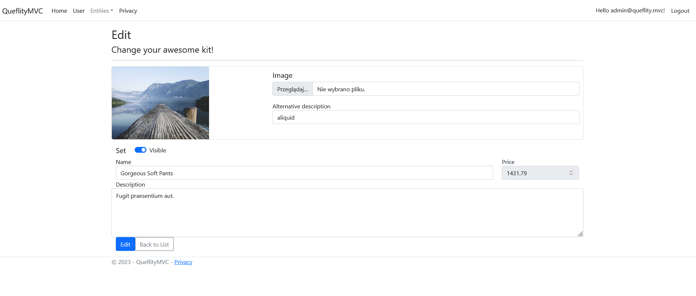

# Queflity

Queflity is an application designed for crafting and showcasing your list of services. With Queflity, you have the
ability to generate items and kits, each comprising a diverse array of components, all while efficiently managing them.
Additionally, you can specify ingredients for each item, allocate categories, and utilize a straightforward permissions
module for seamless access control.

## Features:

- **Items**: Easily create fundamental service entities, assigning them names, prices, and accompanying images.
- **Kits**: Construct kits comprising items with specified quantities and pieces, conveniently presented with images.
- **Categories**: Employ simple tags to categorize items for better organization and navigation.
- **Ingredients**: Compile a list of non-purchasable components used in crafting items, such as food ingredients,
  enhancing transparency and clarity.
- **Admin Panel**: Access a comprehensive administrative interface to efficiently manage user roles and their
  permissions, ensuring smooth operation and security. There also a enabling/disabling users feature.
- **OAuth** - users can login via Google OAuth 2.0.
- **Dashboard** - main view with details for products.

## Tech Stack

- **.Net MVC**: The application adheres to the Model-View-Controller (MVC) pattern, facilitating structured development
  and separation of concerns.
- **Docker**: Leveraging Docker as the runtime environment for the application and its associated database ensures
  consistency and portability across different platforms.
- **Clean Architecture**: Following the principles of clean architecture, the application employs a repository-service
  pattern, enhancing maintainability, and testability.
- **FluentValidation**: Utilized for both frontend and backend validation, FluentValidation simplifies the validation
  process, ensuring data integrity and user experience.
- **Bogus**: Employed for seeding data during development, Bogus streamlines the process of generating test data,
  enabling efficient testing and debugging.
- **EF Core**: Utilized as the Object-Relational Mapping (ORM) tool, Entity Framework Core facilitates database
  interaction, simplifying data access and manipulation within the application.
- **Custom pagination**: A custom, reusable pagination module has been developed, featuring a factory and partial view
  for enhanced usability and flexibility. This module streamlines pagination implementation across various sections of
  the application, offering a seamless user experience and reducing development overhead.
- **Emails**: sending emails via SMTP using MailKit and Quartz for one-off jobs

## Installation

### Installation by Visual Studio

- clone repo onto your desktop
- open solution
- install Docker
- launch app from VS
    - make sure ports **5000**, **5001** are not used by any other process
    - in debug there will be seeded data
- navigate to app in browser
    - [localhost:5001](https://localhost:5001) for https connection
    - [localhost:5000](https://localhost:5000) for http connection
- default admin user credentials are:
    - login: *admin@queflity.mvc*
    - password: *Password1#*
    - you cannot remove this account, only change it's password

## Screenshots

## Authors

- [Marcin Szopa (@MrD4rkne)](https://github.com/MrD4rkne)

## Acknowledgements

- App developed as a part of course [Become an .Asp Net programmer](https://szkoladotneta.pl/)
- Thanks to everyone, who gave me great advice [discord](https://discord.com/servers/szkola-dotneta-822236190149050389)

- App developed as a part of course [Become an .Asp Net programmer](https://szkoladotneta.pl/)
- Thanks to everyone who gave me great advice
  from [discord](https://discord.com/servers/szkola-dotneta-822236190149050389)

## License

[MIT](./LICENSE.txt)
