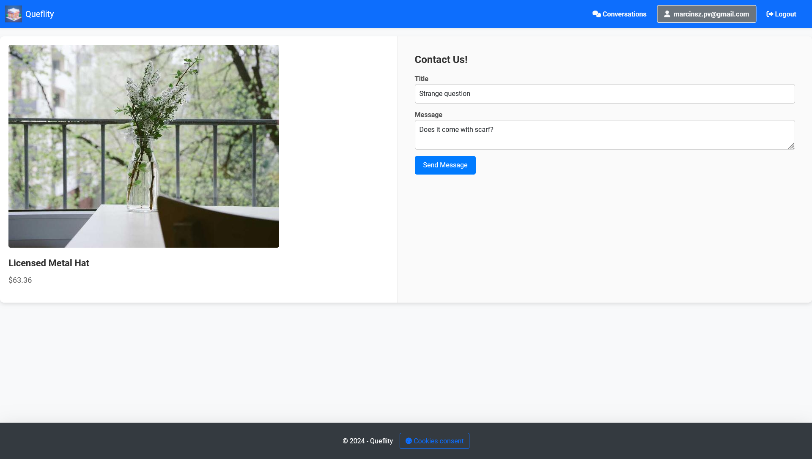
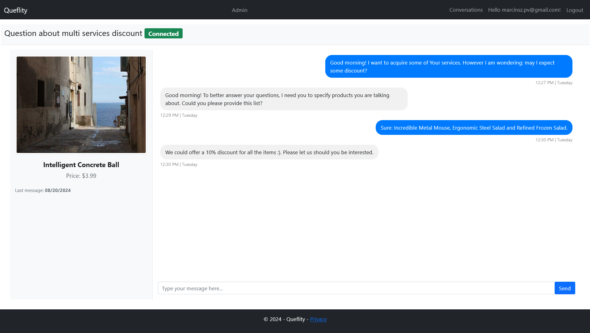
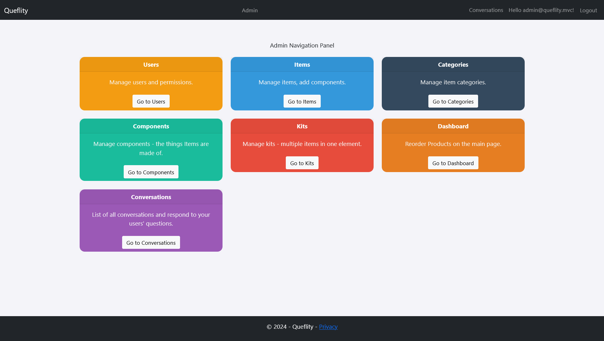
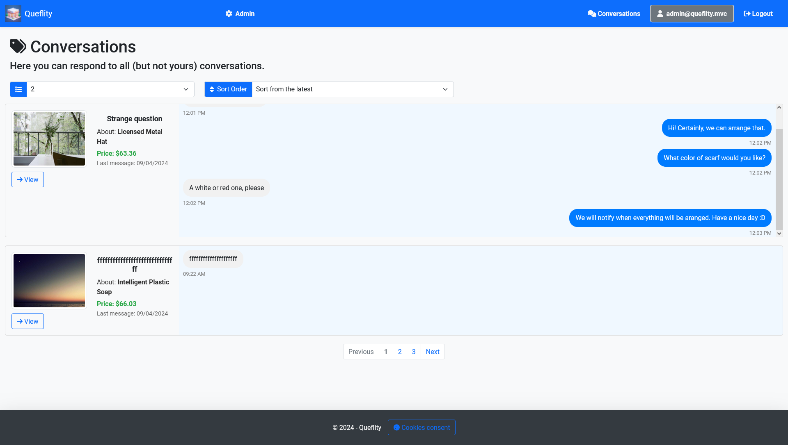
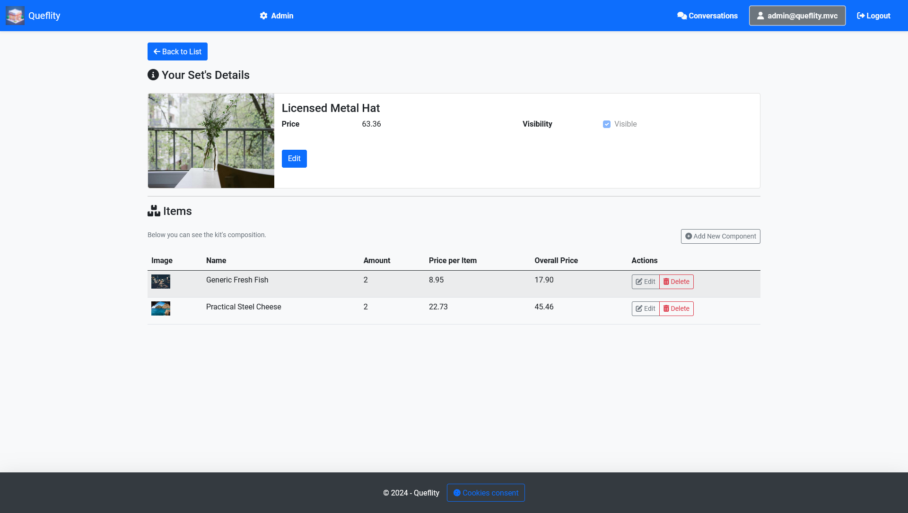
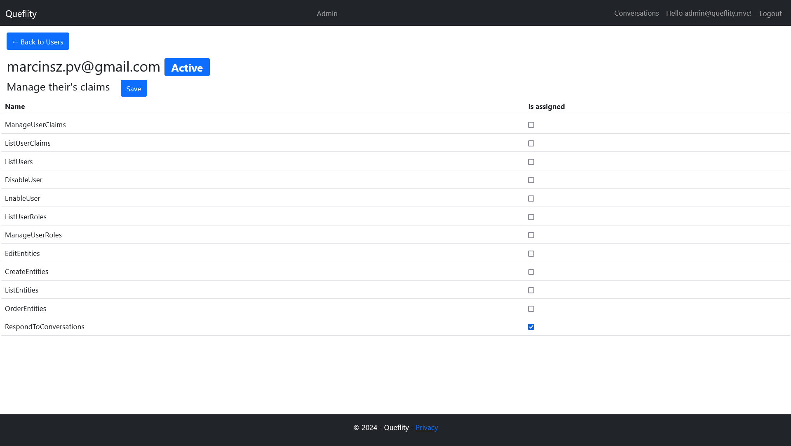
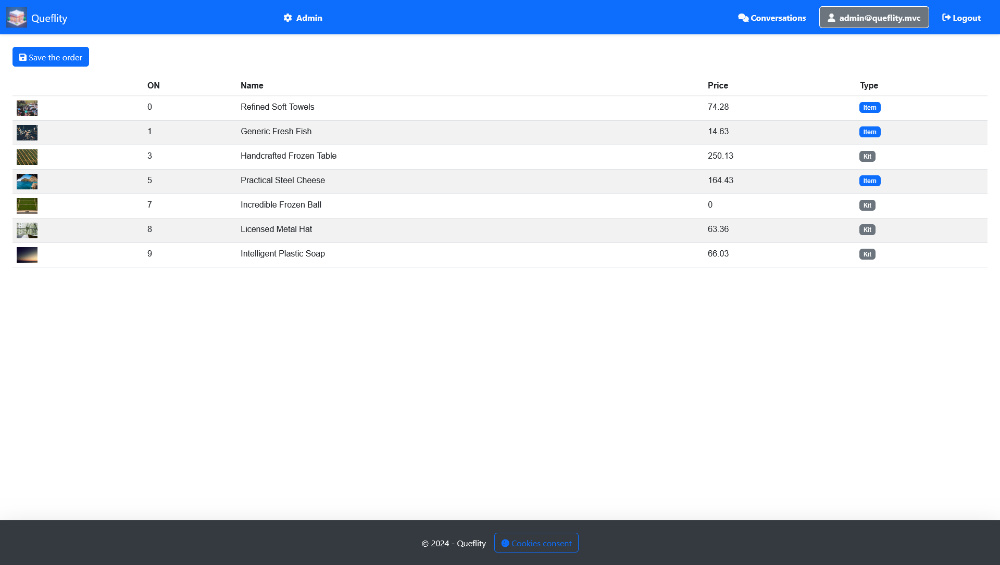

# Queflity

**Queflity** is a versatile application designed for creating and managing a list of services. It allows users to
generate items and kits, each composed of a variety of components. With Queflity, you can efficiently manage these
components, categorize them, specify ingredients, and control access through a simple yet powerful permissions module.

## Features

- **Items**: Create and manage service entities with names, prices, and images.
- **Kits**: Build kits from items, specifying quantities and pieces, all presented with images.
- **Categories**: Organize items using simple tags for better navigation.
- **Ingredients**: Compile lists of non-purchasable components (e.g., food ingredients) used in crafting items for
  enhanced transparency.
- **Admin Panel**: Access a comprehensive interface to manage user roles, permissions, and the ability to enable/disable
  users.
- **OAuth**: Support for Google OAuth 2.0 login.
- **Dashboard**: Main view displaying detailed information about products.
- **Messaging Module**: Users can initiate a conversation about a product, creating a live chat session, with a copy of
  the message sent to their email.

## Tech Stack

- **.NET MVC**: Adheres to the Model-View-Controller (MVC) pattern, ensuring structured development and separation of
  concerns.
- **Docker**: Utilized as the runtime environment, ensuring consistency and portability across different platforms.
- **Clean Architecture**: Employs a repository-service pattern, enhancing maintainability and testability.
- **FluentValidation**: Used for both frontend and backend validation, simplifying the process and ensuring data
  integrity.
- **Bogus**: Streamlines test data generation during development, aiding efficient testing and debugging.
- **EF Core**: Entity Framework Core is used as the Object-Relational Mapping (ORM) tool, simplifying database
  interaction.
- **Custom Pagination**: A reusable pagination module featuring a factory and partial view, providing enhanced usability
  and flexibility across the application.
- **SignalR**: Facilitates real-time messaging between users, enhancing the user experience.
- **Quartz & Mailkit**: Facilitates sending emails via SMTP and managing one-off jobs.

## Installation

### Installation via IDE

1. Clone the repository to your desktop.
2. Open the solution in your preferred IDE.
3. Install Docker.
4. Configure the app (see: [Configuration](./docs/CONFIGURATION.md)).
5. Launch the app:

- Ensure that ports **5000** and **5001** are not used by any other process.
- Debug mode will seed the database with initial data.

6. Navigate to the app in your browser:

- [https://localhost:5001](https://localhost:5001) for the HTTPS connection.
- [http://localhost:5000](http://localhost:5000) for the HTTP connection.

7. Default admin user credentials:

- **Login**: `admin@queflity.mvc`
- **Password**: `Password1#`
- Note: This account cannot be removed but the password can be changed.

## Screenshots

*Home page - what clients see when then first open the app.*

*View to ask about product and start chat about it.*

*Page for your users to chat about product.*

*Admin panel - where you can manage users, products and answer to questions.*

*List of all conversations.*

*Details of a kit.*

*Manage user's permissions.*

*Reorder products on the home page.*

## Authors

- [Marcin Szopa (@MrD4rkne)](https://github.com/MrD4rkne)

## Acknowledgements

- This app was developed as part of the course [Become an ASP.NET Programmer](https://szkoladotneta.pl/).
- Special thanks to everyone who provided valuable advice in
  the [Szkola Dotneta Discord community](https://discord.com/invite/Q2gFDvpKVs).

## License

This project is licensed under the [MIT License](./LICENSE.txt).
